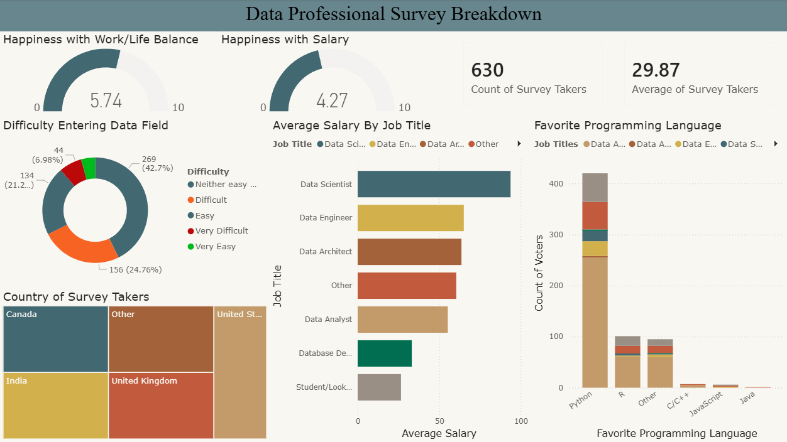

# Data Professional Survey Insights (Power BI)

## Project Overview
This project analyzes survey responses from global data professionals to uncover insights into salary trends, job roles, programming preferences, and career satisfaction levels.
The dashboard provides interactive visualizations to explore how factors such as role, country, and experience influence compensation and job satisfaction.

## Tools & Technologies Used
- Power BI Desktop
- Power Query (Data Cleaning & Transformation)
- Data Modeling
- DAX (Custom Measures & Calculations)
- Data Visualization & Dashboard Design

## Key Insights
- Data Scientists report the highest average salary among surveyed roles.
- Python is the most preferred programming language.
- Most respondents found breaking into data moderately difficult.
- Work-life balance satisfaction scores are higher than salary satisfaction.
- Salary varies significantly by role and region.

## DAX Measures Created
- Average Salary (Custom Measure)
- Aggregated KPI calculations for survey metrics

## Dashboard Preview

## Skills Demonstrated
- Data Cleaning & Transformation
- KPI Development
- DAX Measure Creation
- Data Modeling Relationships
- Insight Communication Through Visual Storytelling
- Business Intelligence Dashboard Design
